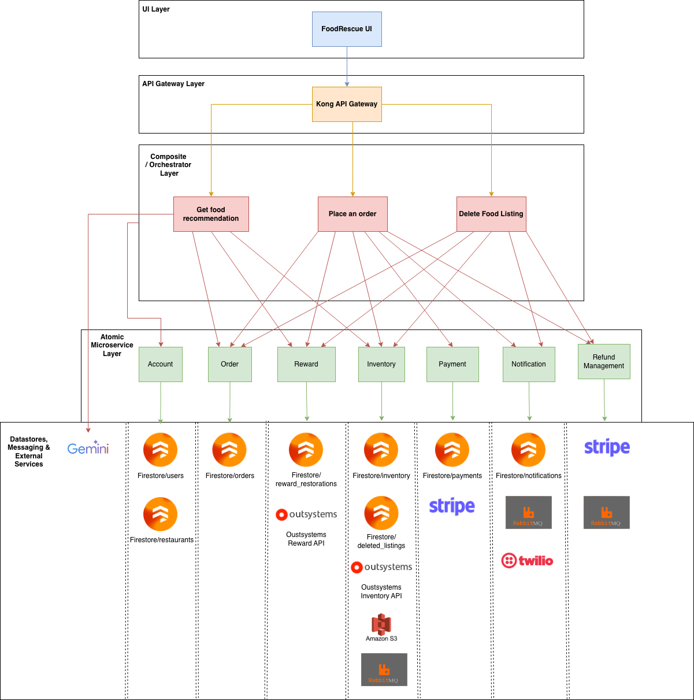
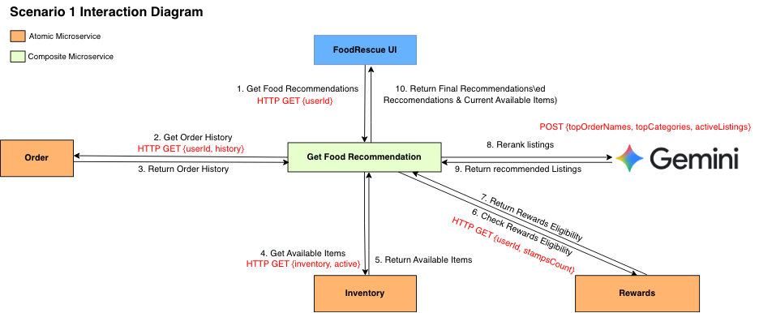
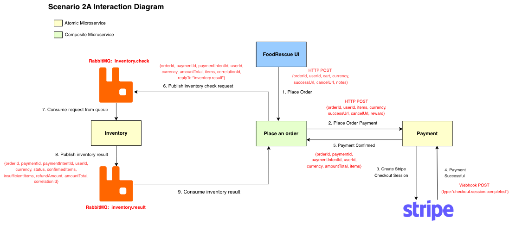
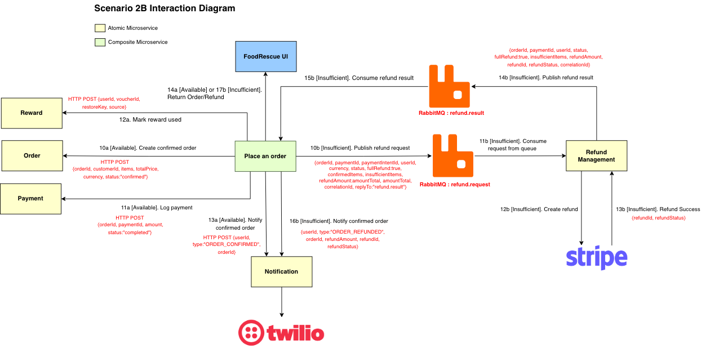
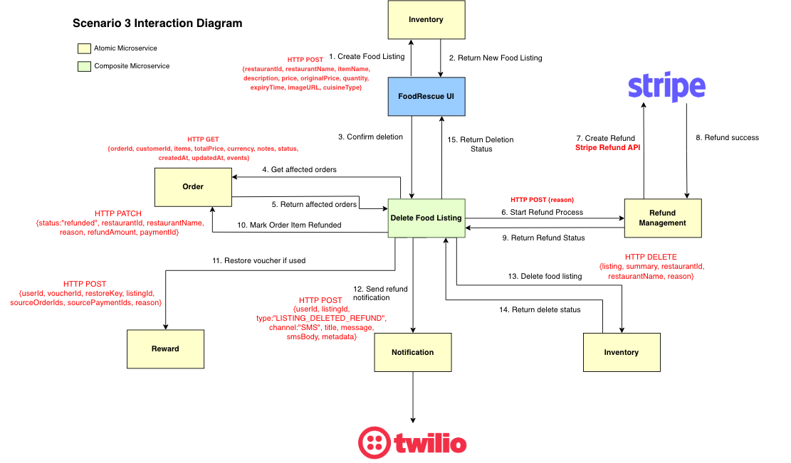

# FoodRescue

FoodRescue is a microservices-based web platform that helps reduce food waste by connecting customers with time-sensitive surplus meals from restaurants at discounted prices.

The current repository is organized around:

- a React frontend
- Kong as the API gateway
- 3 composite / orchestrator microservices only
- atomic microservices for domain responsibilities
- RabbitMQ for asynchronous order-processing flows
- external integrations such as Firebase, Stripe, Twilio, Amazon S3, Gemini, and OutSystems

## Current Architecture

The current repo uses these composite microservices only:

- `get-food-recommendation`
- `place-order`
- `delete-listing`

### SOA Layers Diagram



## Problem Statement

Restaurants frequently have unsold food near the end of the day, while customers are often looking for affordable meals nearby. Without a coordinated system, this food is wasted and restaurants lose potential revenue.

FoodRescue addresses this by:

- Allowing restaurants to publish discounted rescue meals before they expire
- Surfacing relevant listings to customers
- Supporting secure checkout and payment
- Notifying users about order outcomes and refunds
- Rewarding repeat rescue behavior with discount eligibility
- Allowing restaurants to remove listings safely while automatically refunding affected customers

## User Scenarios

### User Scenario Videos

https://youtu.be/MrNy8Xkz2WM

### Scenario 1: Get Food Recommendation

The `get-food-recommendation` composite orchestrates:

- `order` for customer order history
- `inventory` for currently active listings
- `reward` for reward eligibility
- Gemini for reranking recommended listings

Main external route:

- `GET /recommendations/:userId`



### Scenario 2A: Place Order, Payment, and Inventory Check

The first half of the order flow is handled by `place-order` and `payment`:

- the user places an order through `place-order`
- `place-order` creates a checkout session through `payment`
- `payment` creates the Stripe checkout session
- after payment is confirmed, `place-order` publishes an inventory check request to RabbitMQ
- the inventory worker consumes `inventory.check` and publishes the result to `inventory.result`

Main external route:

- `POST /orders/place`

Internal follow-up:

- `POST /orders/payment-confirmed`



### Scenario 2B: Order Outcome or Refund Outcome

The second half of the order flow handles the final business outcome:

- if stock is available, `place-order` creates the confirmed order, logs the payment, updates reward usage if needed, and triggers notifications
- if stock is insufficient, `place-order` publishes a refund request to RabbitMQ
- `refund-management` consumes `refund.request`, creates the Stripe refund, and publishes `refund.result`
- `place-order` consumes the refund result and triggers the final refund notification

Queues used in the current implementation:

- `inventory.check`
- `inventory.result`
- `refund.request`
- `refund.result`



### Scenario 3: Create Listing and Delete Listing with Refunds

Scenario 3 has two parts in the current codebase:

- **Create listing** is a direct `FoodRescue UI -> Inventory` interaction
- **Delete listing** is orchestrated by the `delete-listing` composite

The delete flow:

- builds a delete preview using `inventory` and `order`
- calls `refund-management` to process refunds
- marks affected order items as refunded in `order`
- restores vouchers in `reward` if needed
- sends notifications through `notification`
- deletes and archives the listing in `inventory`

Main external routes:

- `POST /inventory/upload-image`
- `POST /inventory/listings`
- `GET /delete-listing/:listingId/preview`
- `DELETE /delete-listing/:listingId`



## Services

### Composite / Orchestrator Microservices

| Service | Responsibility |
| --- | --- |
| `composite/get-food-recommendation` | Scenario 1 orchestration across order, inventory, reward, and Gemini |
| `composite/place-order` | Scenario 2 orchestration across payment, inventory result handling, order creation, reward update, refund queueing, and notification |
| `composite/delete-listing` | Scenario 3 delete preview, refund orchestration, order updates, reward restoration, notification, and final listing deletion |

### Atomic Microservices

| Service | Responsibility |
| --- | --- |
| `services/account` | authentication, user and restaurant profiles, cart, impact metrics, leaderboard |
| `services/order` | order persistence, order history, affected-order lookups, item refund status updates |
| `services/reward` | reward eligibility, voucher usage, voucher restoration |
| `services/inventory` | listing CRUD, active/deleted listings, image upload, OutSystems inventory integration |
| `services/payment` | payment records, Stripe checkout session creation, Stripe webhook handling |
| `services/notification` | in-app notifications, Twilio SMS delivery, notification storage |
| `services/refund-management` | refund worker and HTTP refund endpoint, Stripe refund execution, refund queue result publishing |

### Background Workers

| Worker | Responsibility |
| --- | --- |
| `services/inventory/consumer.js` | consumes `inventory.check`, validates stock sequentially, and publishes `inventory.result` |

## Platform Components and Integrations

- `Kong Gateway` for public routing, CORS, Stripe webhook route restriction, and recommendation route rate limiting
- `RabbitMQ` for Scenario 2 queue-based processing
- `Firebase / Firestore` for persisted service-owned collections
- `Stripe` for checkout and refunds
- `Twilio` for SMS notifications
- `Amazon S3` for food listing images
- `Gemini` for recommendation reranking
- `OutSystems Inventory API` for inventory data and decrements
- `OutSystems Reward API` for reward eligibility logic

## Repository Structure

```text
api/                    Kong configuration
composite/              Current composite microservices
docs/diagrams/          Scenario and architecture diagrams used in this README
frontend/               React frontend
services/               Atomic services and workers
docker-compose.yml      Main local runtime
DOCKER.md               Short Docker notes
README.md               This file
```

## Local Configuration

### Required Local File

Place the Firebase Admin service account file (serviceAccountKey.json) here:

- `services/firebase/serviceAccountKey.json`

This file is mounted into the Firebase-backed containers by `docker-compose.yml`.

### `.env` Files Used By The Current Repo

The current local setup uses these `.env` files

Using the values provided in FoodRescue Environment Variables.txt, create a .env file in each of the following directories:

- `services/inventory/.env`
- `services/payment/.env`
- `services/notification/.env`
- `composite/place-order/.env`
- `composite/get-food-recommendation/.env`
- `frontend/.env`

What they are used for:

- `services/inventory/.env`
  - S3 credentials and inventory-side runtime settings
- `services/payment/.env`
  - Stripe keys, Stripe webhook secret, and payment runtime settings
- `services/notification/.env`
  - Twilio credentials and notification runtime settings
- `composite/place-order/.env`
  - place-order runtime overrides such as local port and endpoint configuration
- `composite/get-food-recommendation/.env`
  - Gemini API key
- `frontend/.env`
  - local Vite endpoint overrides and S3 display configuration when running the frontend outside Docker

Notes:

- for the default Docker setup, the frontend also receives `VITE_*` values directly from `docker-compose.yml`
- `delete-listing` does not currently use its own `.env` file; its runtime wiring is defined in `docker-compose.yml`
- OutSystems base URLs are injected through `docker-compose.yml` and may be overridden with shell environment variables before startup:
  - `OUTSYSTEMS_INVENTORY_BASE_URL`
  - `OUTSYSTEMS_REWARD_BASE_URL`

Important:

- Do not commit real secrets to public repositories
- Rotate any provider credentials before external sharing or submission if needed

## Docker Runtime

The project is designed to run from the root `docker-compose.yml`.

From the project root:

```sh
docker compose up --build
```

To stop the stack:

```sh
docker compose down
```

Recommended startup flow:

1. Place the Firebase key in `services/firebase/serviceAccountKey.json`.
2. Populate the required `.env` files listed above.
3. Start the full stack with `docker compose up --build`.
4. Open the frontend at `http://localhost:5173`.
5. Access the API through Kong at `http://localhost:8000`.

## Stripe Webhook Setup

For local Stripe webhook testing, run this on the host machine:

```sh
stripe listen --forward-to http://localhost:3003/payments/webhook
```

Then place the generated webhook secret in:

- `services/payment/.env`

## Test Accounts

You are able to create your own accounts, however below are some test accounts that you can use.

### User
Email: test@gmail.com
Password: test

### Restaurant
Email: restaurant1@gmail.com
Password: test

Email: restaurant2@gmail.com
Password: test

Email: restaurant3@gmail.com
Password: test

Due to Twilo limitations, only one phone number can be added as a verfied phone number. Thus for testing purposes, you can use the account of test@gmail.com and password test.

## Access URLs

- Frontend: `http://localhost:5173`
- Kong Gateway: `http://localhost:8000`
- Kong Admin API: `http://localhost:8001`
- RabbitMQ Management UI: `http://localhost:15672`

RabbitMQ default credentials:

- username: `guest`
- password: `guest`

## Exposed Host Ports

| Component | Host Port | Purpose |
| --- | ---: | --- |
| frontend | 5173 | React UI |
| kong | 8000 | public API gateway |
| kong admin | 8001 | Kong admin API |
| rabbitmq | 5672 | AMQP broker |
| rabbitmq ui | 15672 | RabbitMQ management UI |
| inventory | 3000 | inventory HTTP API |
| account | 3001 | account/auth/profile/cart API |
| payment | 3003 | payment HTTP API |
| order | 3004 | order HTTP API |
| reward | 3005 | reward HTTP API |
| notification | 3006 | notification HTTP API |
| get-food-recommendation | 4000 | recommendation composite |
| place-order | 4001 | place-order composite |
| delete-listing | 4005 | delete-listing composite |

Notes:

- the frontend should normally call Kong on port `8000`
- `refund-management` and `inventory-consumer` run inside the Docker network and are not exposed as public host ports

## Kong Route Prefixes

The current Kong config exposes these public route prefixes:

| Route Prefix | Target |
| --- | --- |
| `/account` | account service |
| `/inventory` | inventory service |
| `/orders` | order service and place-order composite routes |
| `/payments` | payment service |
| `/reward` | reward service |
| `/notifications` | notification service |
| `/recommendations` | get-food-recommendation composite |
| `/delete-listing` | delete-listing composite |

## Current Behavior Notes

- The recommendation route is rate-limited at Kong to `5 requests per minute per IP`
- When the frontend receives a `429` on recommendations, it falls back to the last successful recommendation snapshot instead of showing a hard failure
- Scenario 2 propagates `x-correlation-id` across HTTP calls, RabbitMQ messages, logs, and Stripe session metadata
- Scenario 3 create-listing is direct UI-to-inventory; only delete-listing uses the composite/orchestrator

## Troubleshooting

- If Firebase-backed services fail at startup, verify that `services/firebase/serviceAccountKey.json` exists and is locally available.
- If payments do not update after checkout, verify Stripe CLI is forwarding events to `http://localhost:3003/payments/webhook`.
- If recommendations fall back to simpler ranking, verify the Gemini API key in `composite/get-food-recommendation/.env`.
- If recommendation requests start returning `429`, wait for the Kong rate-limit window to reset or reuse the cached recommendation snapshot in the UI.
- If SMS notifications do not send, verify Twilio credentials in `services/notification/.env` and ensure the user has SMS enabled with a valid phone number.
- If listing images fail to upload, verify the AWS S3 settings in `services/inventory/.env`.
- If inventory or reward flows fail, verify access to the configured OutSystems endpoints.
